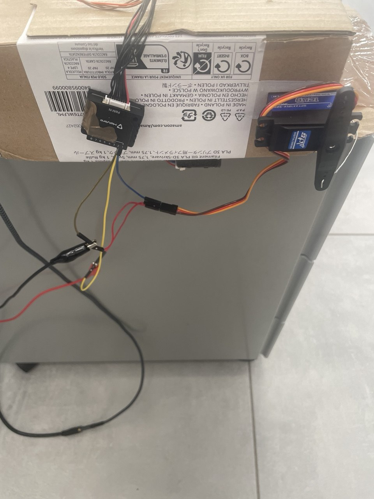

# PX4 (v1.16) + ROS 2 Offboard Servo Control

Questo modulo contiene una guida passo-passo e un nodo ROS 2 C++ per controllare un servomotore collegato alla porta **AUX1** di una Pixhawk eseguendo il firmware **PX4 v1.16**. Il controllo avviene in modalità **Offboard** combinando i setpoint di volo con i comandi generici per gli attuatori (Generic Actuator Control via MAVLink).

Il package contiene un solo nodo ROS 2 C++: `servo_offboard`.

---

## 🗺️ Architettura di Sistema

```text
[ ROS 2 Node ] --(VehicleCommand: CMD 187)--> [ MicroXRCEAgent ]
|
(uORB Topic)
|
v
[ Servomotore ] <-- (PWM AUX1) <-- [ PX4 Actuator Set 1 (Chan 1) ]
```

---

## 🔌 1. Cablaggio Hardware (Cruciale)

L'errore più comune in questa configurazione è la mancanza della massa in comune o la sottoalimentazione della barra AUX. La Pixhawk **non eroga i 5V** sui pin centrali delle porte AUX/MAIN per proteggere la logica interna dai disturbi elettrici dei motori.



### Schema dei collegamenti

1. **Alimentazione del Servo (BEC esterno o Alimentatore da banco):**
	* Connetti il filo **Rosso (+)** del servo direttamente al polo positivo (5V-6V, almeno 2A) dell'alimentatore esterno.
2. **Massa in Comune (Common Ground):**
	* Il filo **Nero/Marrone (-)** del servo deve essere sdoppiato:
	  * Un ramo va al polo negativo `GND` dell'alimentatore esterno.
	  * L'altro ramo va al pin `GND` (fila esterna) della porta **AUX1** della Pixhawk.
3. **Segnale PWM:**
	* Il filo **Giallo/Bianco (Segnale)** del servo va collegato direttamente al pin `Signal` (fila interna) della porta **AUX1** della Pixhawk.

> ⚠️ **ATTENZIONE:** Se non colleghi la massa dell'alimentatore esterno al GND della Pixhawk, il segnale PWM non avrà un potenziale di riferimento e il servo rimarrà immobile o vibrerà in modo anomalo.

---

## 🎛️ 2. Configurazione su QGroundControl (QGC)

A partire da PX4 v1.14+, la gestione dei servomotori avviene tramite la scheda grafica degli attuatori, eliminando i vecchi file di mix manuali.

1. Alimenta la Pixhawk e connettiti a QGroundControl.
2. Vai su **Vehicle Setup (Icona Ingranaggio) -> Actuators**.
3. Scorri fino alla sezione delle uscite fisiche e individua **PWM AUX1** (o *FMU Output 1*).
4. Nel menu a tendina della funzione, seleziona: **`Offboard Actuator Set 1`** -> **`Channel 1`**.
5. Imposta i seguenti parametri standard per le uscite PWM:
	* **Min:** `1000 us`
	* **Max:** `2000 us`
	* **Disarmed:** `1500 us` (o `1000 us` a seconda della posizione neutra desiderata).
6. **Test Hardware:** Scorri in fondo alla pagina fino a *Actuator Testing*, abilita lo switch software e muovi lo slider associato. Se il servo si muove, l'hardware e la configurazione PX4 sono corretti.

---

## 💻 3. Implementazione del Codice ROS 2

Per controllare il servo mentre il drone esegue missioni o mantiene la posizione in Offboard, il nodo ROS 2 deve configurare correttamente due aspetti del protocollo uORB/MAVLink.

### A. Abilitare il controllo attuatori nell'Offboard Mode

Nel topic `/fmu/in/offboard_control_mode`, oltre ai flag di posizione/traiettoria, è obbligatorio attivare il flag `actuator`:

```cpp
OffboardControlMode msg{};
msg.position = true;
msg.actuator = true;
msg.timestamp = this->get_clock()->now().nanoseconds() / 1000;
offboard_pub_->publish(msg);
```

### B. Struttura del messaggio `VehicleCommand` (CMD 187)

Viene utilizzato il comando MAVLink `VEHICLE_CMD_DO_SET_ACTUATOR` (ID 187). La mappatura dei parametri segue questa logica:

```cpp
VehicleCommand cmd{};
cmd.command = VehicleCommand::VEHICLE_CMD_DO_SET_ACTUATOR;

cmd.param1 = value;  // Valore normalizzato da -1.0 a 1.0 per il Canale 1 (AUX1)
cmd.param2 = 0.0f;   // Canale 2
cmd.param3 = 0.0f;   // Canale 3
cmd.param4 = 0.0f;   // Canale 4
cmd.param5 = 0.0f;   // Canale 5
cmd.param6 = 0.0f;   // Canale 6
cmd.param7 = 0.0f;   // Selezione Set: 0.0f corrisponde a "Offboard Actuator Set 1"

cmd.target_system = 1;
cmd.target_component = 1;
cmd.from_external = true;
cmd.timestamp = this->get_clock()->now().nanoseconds() / 1000;
cmd_pub_->publish(cmd);
```

Nota: `param7` usa indici che partono da `0.0f`. Scrivere `1.0f` invierebbe il comando all'Actuator Set 2, ignorando la configurazione fatta su QGC.

---

## ⌨️ 4. Uso del Nodo Attuale

Il nodo `servo_offboard` mantiene il drone in offboard in un thread separato e, nel thread principale, aspetta un comando da tastiera con `scanf`.

### Comportamento

Quando inserisci `y` e premi invio:

1. il nodo pubblica `VehicleCommand` 187 con valore `+1`;
2. il nodo pubblica anche `ActuatorServos` con valore `+1`;
3. dopo `n_sec` secondi ripubblica entrambi con valore `-1`;
4. poi torna in attesa di un nuovo comando.

Se inserisci qualsiasi altro carattere, il nodo viene terminato.

### Parametro

- `n_sec`: tempo di attesa tra la pubblicazione `+1` e la ripubblicazione `-1`.

Esempio:

```bash
ros2 run my_offboard_control servo_offboard --ros-args -p n_sec:=2.0
```

### Avvio agent PX4

In un altro terminale avvia anche l'agent MicroXRCE con:

```bash
sudo MicroXRCEAgent serial --dev /dev/ttyUSB0 -b 921600
```

---